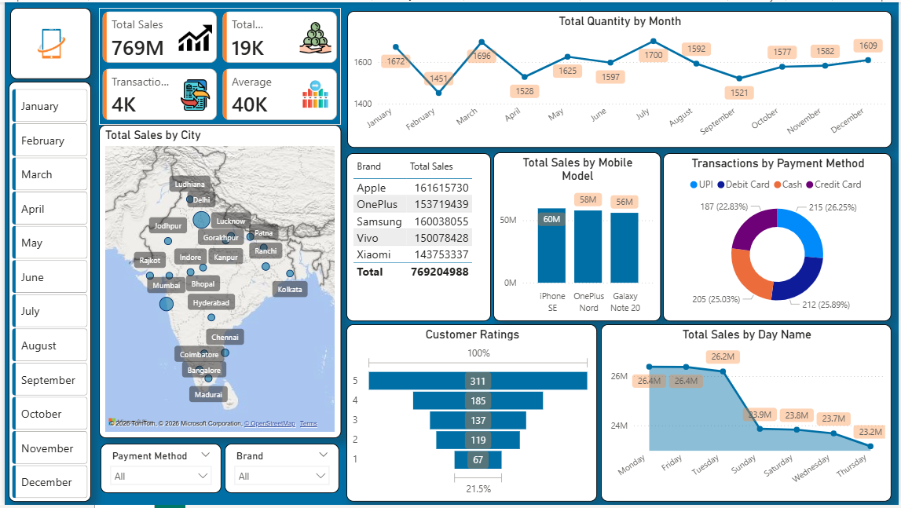

# 📊 Advanced Sales Analytics & Visualization Dashboard (Power BI)

## 📌 Project Overview

This project showcases an interactive **Sales Analytics Dashboard** built using Power BI.
The dashboard provides actionable insights into sales performance, customer behavior, and transaction trends across multiple dimensions such as city, brand, and payment methods.

---

## 🎯 Objectives

* Analyze overall sales performance and trends
* Identify top-performing cities and brands
* Understand customer purchasing behavior
* Track transactions and payment method distribution

---

## 🛠️ Tools & Technologies

* **Power BI** – Data visualization and dashboard creation
* **Microsoft Excel / CSV** – Data preprocessing

---

## 📊 Dashboard Features

### 🔹 Key KPIs

* Total Sales
* Total Quantity Sold
* Total Transactions
* Average Sales Value

### 🔹 Visualizations

* 📈 Monthly Sales Trend Analysis
* 🗺️ Sales by City (Map Visualization)
* 📱 Sales by Mobile Brand & Model
* 💳 Transactions by Payment Method
* ⭐ Customer Ratings Distribution
* 📅 Sales Analysis by Day of Week

---

## 📷 Dashboard Preview

---

## 🔍 Key Insights

* Peak sales observed during mid-year months
* UPI and Debit Cards are the most preferred payment methods
* Apple and Samsung lead in total sales
* Metro cities contribute significantly to overall revenue

---

## 📁 Repository Contents

* `Mobile Sales Dashboard.pbix` → Power BI report file
* `Mobile Sales Data.xlsx` → Source data
* `Dashboard.PNG` → Dashboard preview image
* `README.md` → Project documentation

---

## 🚀 How to Use

1. Download the `.pbix` file
2. Open it in Power BI Desktop
3. Refresh the dataset (if needed)
4. Explore interactive visuals and filters

---

## 💡 Future Enhancements

* Integration with live database (real-time data)
* Advanced forecasting using time series analysis
* Drill-through and dynamic filtering improvements

---

## 👤 Author

**Rasika Tembhare**

* Aspiring Data Analyst
* Experience in Production Support (Linux & MySQL)

---
